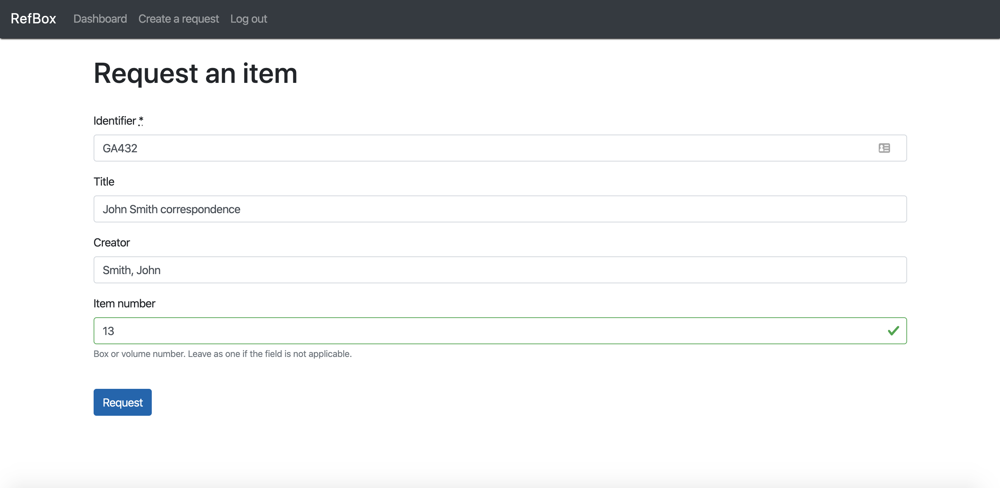
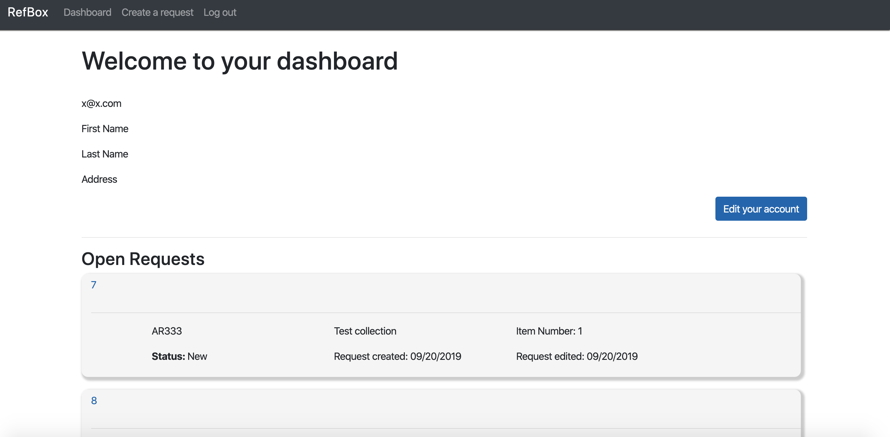
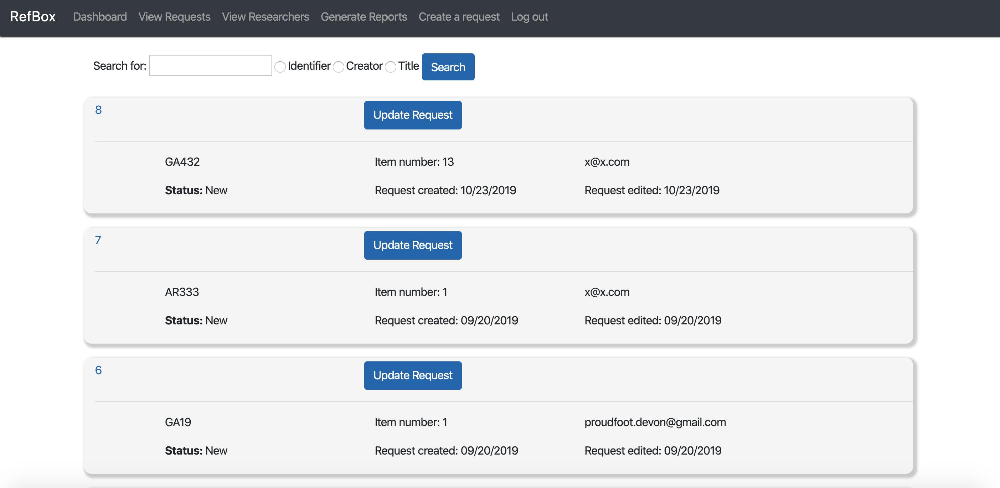
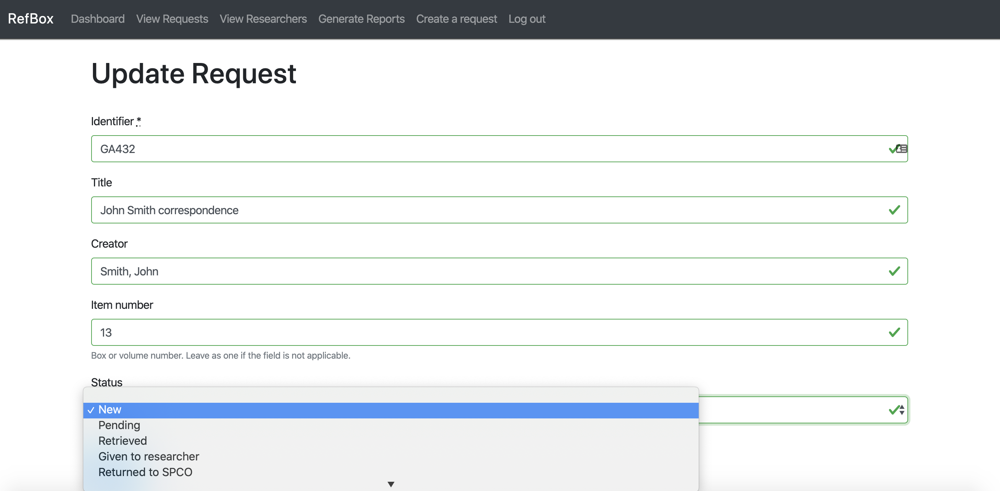
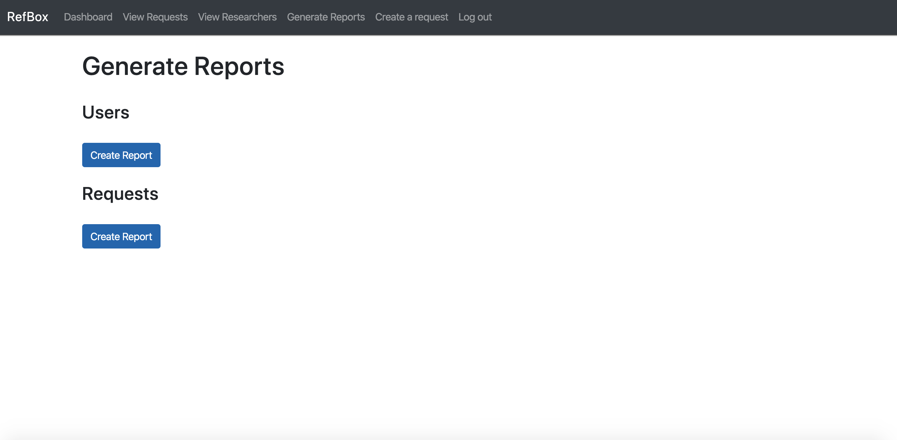

# RefBox

**_A tool for managing patron requests for archives and special collections_**

[View project](https://refbox.herokuapp.com)

## Running locally

To run the application locally, ensure that your computer has Ruby version 2.5.3.  Clone the repository by running `git clone https://github.com/devonproudfoot/refbox`.  Navigate to the folder on your computer and run `bundle install` to install all relevant gems and `rake db:migrate` to create the initial database.  Finally, run `rails server -b 0.0.0.0 -p 3000` and navigate to localhost:3030 in the web browser of your choice!

## Overview

Refbox is a Ruby on Rails application that allows researchers to submit and track requests for the use of archival material.  Staff accounts are then able to view and update request statuses, view researcher accounts, and export data.  New features are actively being added.

## Researchers

Begin by logging in, or creating a new account from the homepage, found in the navigation bar.

Logging in should change the homepage, and allow a user to create a request for an item.  After filling out the collection information (the title, creator, identifier, and item number) clicking request will allow a staff member to retrieve the material.

Researcher accounts are also able to select the "Dashboard" option in the navigation bar to see account information, and view all open and pending requests.

## Staff Members

Staff members have higher privileges than researcher accounts.  The navigation bars have options for viewing both researchers and requests at a broad level.

Clicking on a specific requests will allow staff members to view or update a request. The status can be changed when material has been brought to a researcher, returned, or re-shelved. 

To better facilitate the collection of data on an annual basis, researcher information or request information can be exported as a CSV file.  The reports page can be found in the navigation bar.

